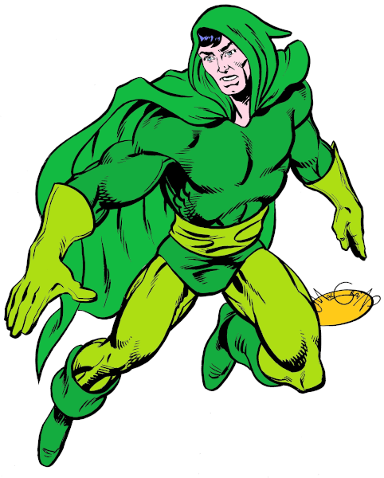
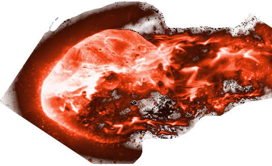
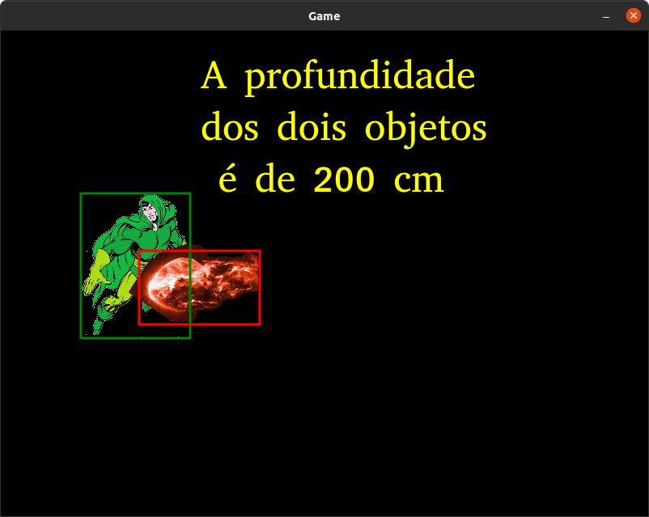
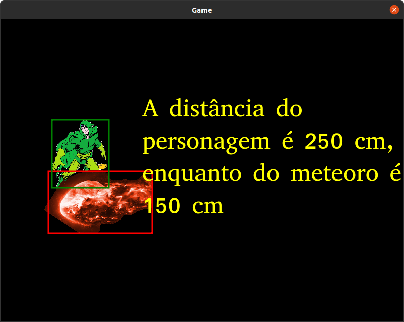
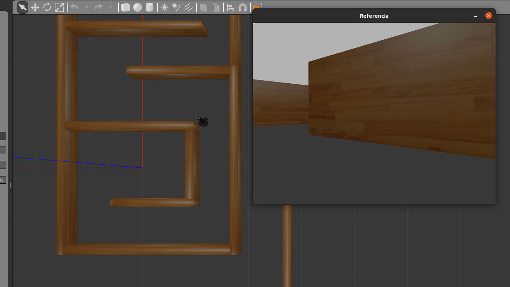

# Robótica Computacional 2022.2

## Simulado para a Avaliação Intermediária (P1)

**Indique seu nome e as questões que escolheu fazer logo abaixo. Você deve escolher 2 questões, senão o avaliador o fará por você. No dia da prova, você deverá escolher 4 de 5 questões**

Nome:_______________

Questões que fez:____________

**Observações de avaliações nesta disciplina:**

* Clone o repositório da prova dentro de `~/catkin_ws/src` se estiver trabalhando no Linux.
* Você poderá dar quantos `git push` quiser no repositório, apenas o último será considerado.
* Antes de finalizar a prova verifique que os arquivos enviados ao github estão na sua última versão. É sua responsabilidade garantir isso.
* Só finalize a prova no Blackboard após enviar a prova via Github classroom.
* Ponha o nome no enunciado da prova no Github
* Tenha os repositórios https://github.com/Insper/robot22.2/ ,  https://github.com/arnaldojr/my_simulation e https://github.com/arnaldojr/mybot_description.git  atualizados em seu `catkin_ws/src`.
* Você pode consultar a internet ou qualquer material, mas não pode se comunicar com pessoas ou colegas a respeito da prova
* Todos os códigos fornecidos adicionalmente aos scripts em que as questões serão desenvolvidas foram testados em outro contexto, e são apenas um compilado. Não é obrigatório usar. Fique à vontade para modificar esse código e trazer outros arquivos que achar melhor. 
* Teste sempre seu código
* Entregue código que executa - código com erro que impede de executar implica em zero na questào
* Faça commits e pushes frequentes no seu repositório (tem dicas [no final deste arquivo](./instrucoes_setup.md))
* Permite-se consultar qualquer material online ou próprio. Não se pode compartilhar informações com colegas durante a prova.
* Faça commits frequentes. Em caso de disputa sobre plágio, o primeiro a enviar alguma ideia será considerado autor original.
* A responsabilidade por ter o *setup* funcionando é de cada estudante.
* Questões de esclarecimento geral podem ser perguntadas no chat do Teams.
* É proibido colaborar ou pedir ajuda a colegas ou qualquer pessoa que conheça os assuntos avaliados nesta prova.
* Os exercícios admitem diversas estratégias de resolução. A prova de cada aluno é única. Atenha-se apenas à rubrica de cada questão.

Existe algumas dicas de referência rápida de setup [instrucoes_setup.md](instrucoes_setup.md)

**Integridade Intelectual**

Se você tiver alguma evidência de fraude cometida nesta prova, [use este serviço de e-mail anônimo](https://www.guerrillamail.com/pt/compose)  para informar ao professor através do e-mail `antoniohps1@insper.edu.br`.

# Questões

## Questão 1  (2.5 pontos)

Nesta questão você irá determinar se o personagem do jogo "Deep Space Warriors" foi atingido por um meteoro. Como o jogo possui 3 dimensões, você deverá checar se os retângulos envolventes (*bounding boxes*) do personagem e do meteoro se interceptam, e se a diferença entre as profundidades deles é menor do que 40 cm. Por profundidade de um objeto entende-se a distância do mesmo até a câmera virtual que gera a imagem do jogo.

As imagens `green_lama.png` e `meteoro.png` correspondem às imagens vistas do personagem e do meteoro se ambos estiverem a uma profundidade de 60 cm. A altura do personagem (comprimento na vertical) é de 180 cm, e do meteoro é de 98.1 cm.

### O que você deverá fazer

Você deverá editar a função `meteoro_acertou()` que irá determinar se o meteoro acertou ou não o personagem. Você não deve se preocupar com as situações em que o personagem encobre totalmente o meteoro ou vice-e-versa, preocupe-se apenas quando ambos os objetos são visíveis

A saída esperada é a imagem com as bounding boxes, o texto `ACERTOU`escrito na imagem no caso do meteoro ter acertado o personagem, e as profundidades (distâncias) dos objetos escritas no terminal.

*Exemplo de situação onde o meteoro acertou o personagem*
Não precisa escrever os dizeres na imagem, apenas `ACERTOU`

*Exemplo de situação onde o meteoro não acertou o personagem*
Não precisa escrever os dizeres na imagem

#### Orientações

Trabalhe no arquivo `./q1/q1.py`. Este exercício **não precisa** de ROS. Portanto pode ser feito até em Mac ou Windows

#### O que você deve fazer:

|Resultado| Conceito| 
|---|---|
| Não executa | zero |
| Determina a distância focal da câmera virtual | 0.6|
| Segmenta o personagem e o meteoro (separadamente), mostrando evidências | 1.3|
| Identifica as profundidades dos objetos e escreve no terminal | 2.1 |
| Identifica corretamente a colisão entre os objetos | 2.5 |

Casos intermediários ou omissos da rubrica serão decididos pelo professor.

## Questão 2  (2.5 pontos)

Nesta questão você deverá fazer um retângulo em volta de todas as bandeiras do Brasil.
Não poderá ser usada a informação da posição nem a área absoluta das mesmas. 
Ou seja, as bandeiras deveriam ser recohecidas mesmo se aparecessem em posições em tamanhos diferentes.

Observe que há bandeiras com cores semelhantes, porém apenas a do Brasil possui figuras com cores distintas uma dentro da outra.

#### Orientações

Trabalhe no arquivo `q2/q2.py`. Este exercício **não precisa** de ROS. Portanto pode ser feito até em Mac ou Windows

#### O que você deve fazer:

|Resultado| Conceito| 
|---|---|
| Não executa | zero |
| Segmenta a cor verde e gera saída visual |0.6|
| Identifica pelo menos uma bandeira do Brasil | 1.0|
| Identifica todas as bandeira do Brasil e até duas outras | 1.5|
| Identifica todas as bandeira do Brasil e apenas uma outra | 2.0|
| Identifica todas e apenas as bandeiras do Brasil| 2.5 |

Casos intermediários ou omissos da rubrica serão decididos pelo professor.

## Questões de ROS

**Atenção: ** 

Para fazer estas questões você precisa ter o `my_simulation` e o `mybot_description` atualizado.

    cd ~/catkin_ws/src
    cd my_simulation
    git stash
    git pull

Ou então se ainda não tiver:

    cd ~/catkin_ws/src
    git clone https://github.com/arnaldojr/my_simulation.git

Para o mybot_description:

    cd ~/catkin_ws/src
    cd mybot_description
    git stash
    git pull

Ou então se ainda não tiver:

    cd ~/catkin_ws/src
    git clone https://github.com/arnaldojr/mybot_description

Em seguida faça o [catkin_make](./instrucoes_setup.md). 

## Questão 3 (2.50 pontos)

Seu robô está no labirinto visível abaixo:

    roslaunch my_simulation labirinto_vision.launch

O objetivo do robô é sair do labirinto. Se ele apenas seguir as paredes da esquerda ou da direita com o lidar, deverá ter sucesso na missão.

#### O que é para fazer

Faça o robô encontrar a saída usando visã ocomputacional e/ou laser (pode ser uma combinação de ambos). O uso de outros sensores é opcional e não influenciarão na nota. 

#### Detalhes de como rodar

O código para este exercício está em: `sim1_222/scripts/q3.py`

Para rodar, recomendamos que faça:

    roslaunch my_simulation labirinto_vision.launch

Depois:

    rosrun sim1_222 q3.py

|Resultado| Conceito| 
|---|---|
| Não executa | 0 |
| Faz o robô sair da primeira câmara  | 0.8 |
| Faz o robô seguir pardes com  lidar e percorrer mais de uma câmara, mas não encontra a saída | 1.8 |
| O robô encontra a saída somente com o lidar | 2.5|

Casos intermediários ou omissos da rubrica serão decididos pelo professor.

## Questão 4 (2.50 pontos)

Seu robô está no cenário visível abaixo:

    roslaunch my_simulation encaixotado.launch

#### O que é para fazer

Gire o robô até encontrar o bloco com a figura assinalada (veja a tabela abaixo). Ao centralizar a figura, use o lidar para chegar próximo (30 cm) daquela figura. Depois, gire 180 graus e pare a 30 cm do bloco que está diametralmente oposto.

Quem cujo primeiro nome se inicia com determinada letra da tabela abaixo, deve inicialmente se aproximar da figura correspondente:

|Letra inicial do nome| Figura inicial| 
|---|---|
| A até C | Carro |
| D até H | Cavalo |
| I até P | Bicicleta |
| Q até Z | Carro |

#### Detalhes de como rodar

O código para este exercício está em: `sim1_222/scripts/q4.py`

Para rodar, recomendamos que faça:

    roslaunch my_simulation encaixotado.launch

Depois:

    rosrun sim1_222 q4.py

|Resultado| Conceito| 
|---|---|
| Não executa | 0 |
| Faz o robô detectar a primeira figura apenas, e mostra evidências | 1.0 |
| Consegue centralizar na primeira figura | 1.50|
| Chega próximo à primeira figura | 2.00|
| Dá a volta e chega na segunda figura | 2.50|

Casos intermediários ou omissos da rubrica serão decididos pelo professor.

**Boa sorte!!**